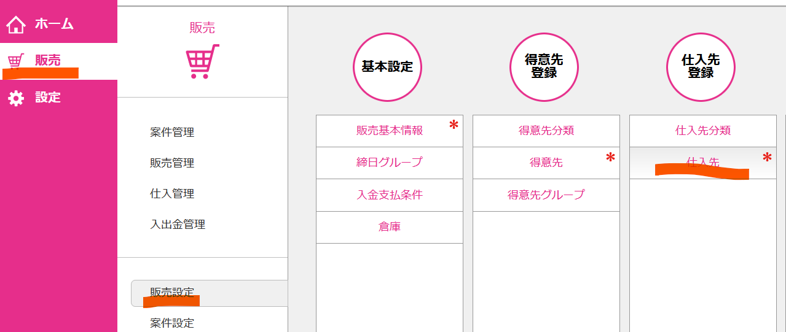
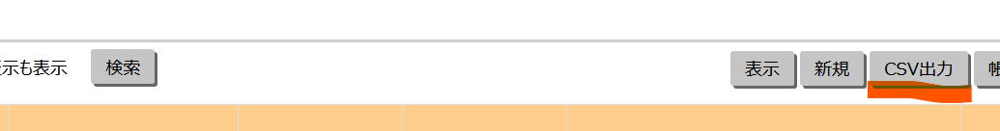
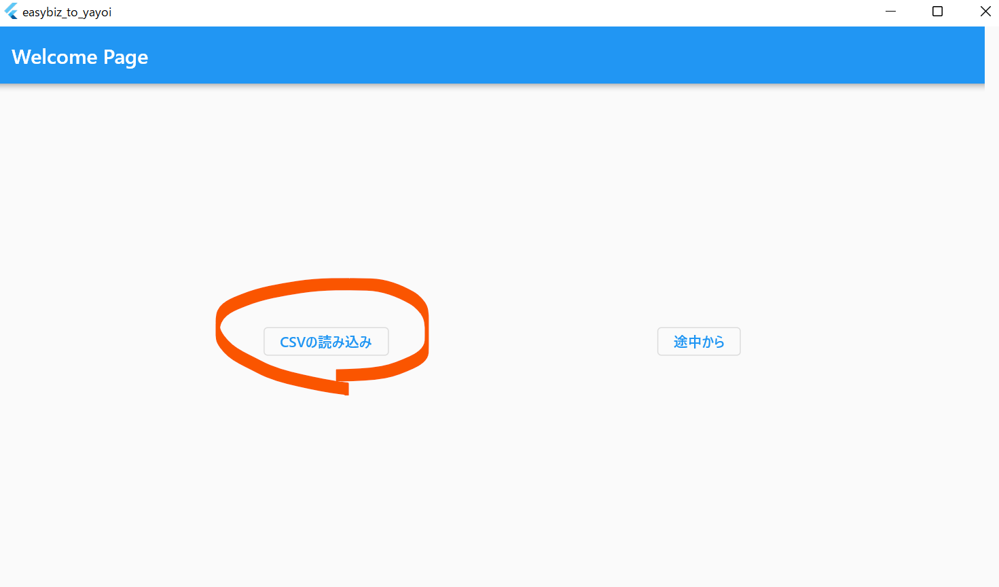
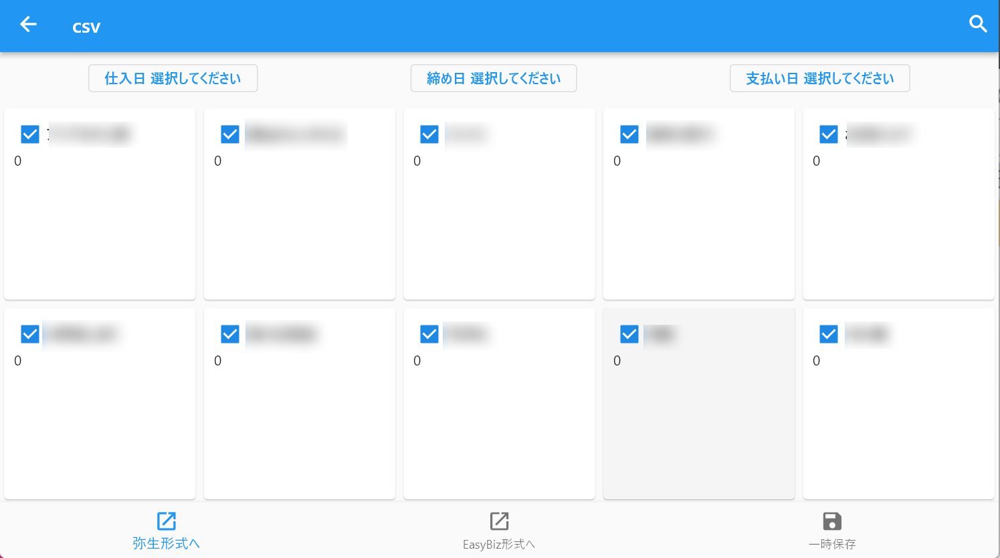
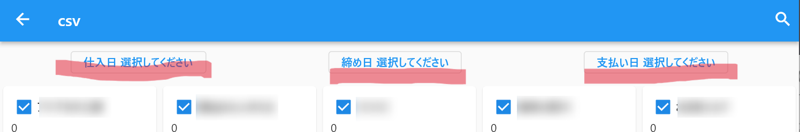
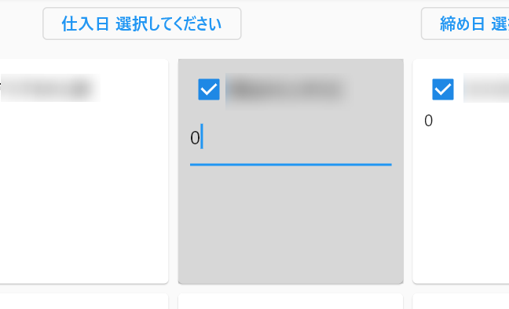
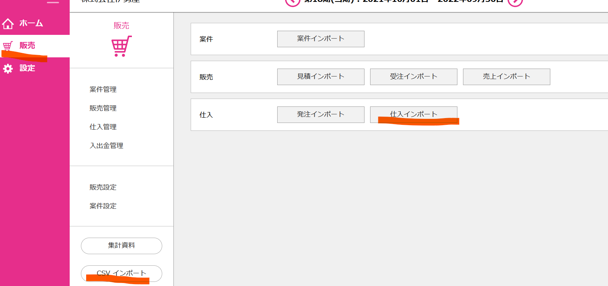
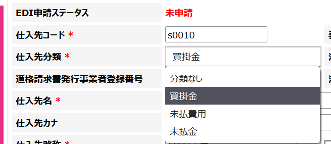

# easybiz_to_yayoi

[十八親和銀行EasyBiz](https://www.easybiz.18shinwabank.co.jp/)から会社明細CSVを読み込み、
仕入用CSVと弥生読み込み用CSVを吐き出すものです。
こちらは個人用ツールとして作成したものをOpenにしているものです。
利用に関しては自己責任でご利用ください。

## Getting Started

このプロジェクトをCloneして使用するか、自分でビルドして利用ください。

Table Of Contents
- [easybiz_to_yayoi](#easybiz_to_yayoi)
  - [Getting Started](#getting-started)
  - [CSVのEasyBizからの書き出しと読み込み](#csvのeasybizからの書き出しと読み込み)
  - [EasyBizコンバーターの利用方法(読み込み)](#easybizコンバーターの利用方法読み込み)
  - [EasyBizコンバーターの利用方法（入力・書き出し）](#easybizコンバーターの利用方法入力書き出し)
  - [outputEasyBiz.csvの読み込み](#outputeasybizcsvの読み込み)
  - [outputYayoi.csvの読み込み](#outputyayoicsvの読み込み)

## CSVのEasyBizからの書き出しと読み込み

1. 会社明細のCSVを取得する  
   [ログイン画面](https://portal.easybiz.18shinwabank.co.jp/login)よりログインし、
   『販売』→『販売設定』→『仕入先』をクリック
   
   その後、『CSV出力』をクリック
   
   これでCSVをダウンロードできます。  

1. アプリを起動し、『CSV読み込み』をクリックし、先程ダウンロードしたCSVファイルを読み込みさせてください。  

## EasyBizコンバーターの利用方法(読み込み)

1. ダウンロードしたCSVファイルを読み込む  
   

1. 読み込みが成功したら以下の画面に遷移します。
   

## EasyBizコンバーターの利用方法（入力・書き出し）

1. まず仕入日・締め日・支払い日を設定してください。
   こちらは<b>書き出し時に必須</b>となります。
   

1. 各ブロックをクリックすると数字が編集できます。
   
1. また、チェックボックス☑を外すと書き出し時に外された会社は書き出しされません。

1. 書き出しは下部のボタンでフォルダを選び、書き出しします。
   書き出しファイル名はそれぞれoutputYayoi.csv , outputEasyBiz.csvとなります。

   
   同様に一時保存もこちらで利用できます。

## outputEasyBiz.csvの読み込み

1. 『販売』→『CSVインポート』→『仕入インポート』にて行なえます。
   

## outputYayoi.csvの読み込み

1. 弥生インポートを利用する際はEasybizの『仕入先分類』が『買掛金』『未払費用』『未払金』のいずれかに入力されている必要があります。  
<b>こちらが入力されてないとエラーとなりますのでご注意ください。</b>
   

1. 